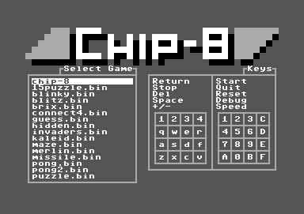
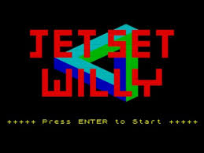

What's Chip-8?
--------------

TODO

* 8-bit games virtual machine 
  TODO: Add a bit of history 

* Demo (so you know where we are heading....)

* Talk outline

  * Quick overview of the chip8 architecture

  * Dive into the clojure implementation

Why did I do this?
------------------

TODO

- Learn a bit more clojure
  (so I dont have to look up the syntax every time ...)

- Really good project for a number of reasons:

  - Pretty small (which gives me a fighting chance of finishing..)
  - Once complete (or semi-complete) you gets lots of reward
    as there already exists lots of games.  

- Learn a little more about chip arhitecture/emulators.

Chip-8 Architecture
-------------------

TODO

- memory
- registers
- pc/stack/etc  
- instrucitons 
- graphics
- timers + sound
- memory map/font data  

General emulator development process algorithnm
-----------------------------------------------

  10: Write the decoder (based on wikipedia entry)
  20: Generate an empty implementation for each instruction (which prints the opcode and exits)
  30: Play a game of your choosing (Arkanoid in my case) until it crashes out on an unimplemented instruction.
  40: Implement the instruction (+ associated unit test).
  50: Goto 30.

Implementation (1): Fetch/decode/execute
----------------------------------------

TODO

  * Tour of the code, including the following

    * Machine state
    * Core loop
    * Instruction decoder
    * Instructions

Implemantaion (2): Threads and shared state
-------------------------------------------

TODO

Implementation (3): Graphics
----------------------------

TODO

  * Originally used seesaw (wrapper for swing).
  * Moved to using the quil animation library. Really simple!    
  * Demo 

Implementation (4) Sound
------------------------

TODO

  * Found it remarkably hard to make my linux laptop make a sound!
  * Tried overtone, which looks great, but still no sound.
  * Ended up playing wav files using a command line utility
    (paplay - linux, afplay - osx)
  * Demo

Testing
-------

  - Why did I bother I hear you ask (seeing as this was a personal project)?
  - Mostly to learn a little more about unit testing in clojure.  

  - Unit tests for each instruction (testing through the core/decoder).
    (Nice because the state of the chip can be passed in via the memory state,
    and you can simply check that it has been updated in the expected way).

  - All other components tested manually by playing games

What's next?
------------

Links
-----

* https://github.com/kristenjacobs/chip8-clj

* https://github.com/kristenjacobs/chip8-clj-slides

* Chip8 details + roms (games and demos)

  * https://en.wikipedia.org/wiki/CHIP-8

  * http://devernay.free.fr/hacks/chip8/C8TECH10.HTM

  * http://www.chip8.com/?page=84

  * http://www.zophar.net/pdroms/chip8/chip-8-games-pack.html

.. header::
    chip8-clj
