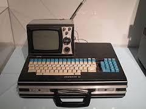
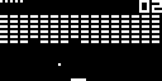

.. image:: title-page.png
   :height: 600px

What's Chip-8?
--------------

* 1970's 8-bit virtual machine targeted at games programming. 
  Originally implemented on kit-based 8-bit micros such as the mighty Telmac 1800
  (2000 units sold mostly in Sweden and Finland)

The plan
--------

* Quick overview of the Chip8 architecture

* Dive into the Clojure implementation

* But first, a quick demo (so you know where we are heading....)

Why did I do this?
------------------

* Mostly to learn a bit more Clojure
  (so I don't have to look up the syntax of reduce every time ...)

* Really good project for a number of reasons:

  * Pretty small (which gives me a fighting chance of finishing..)

  * Once complete (or semi-complete) you gets lots of feedback
    as there already exists lots of games (Pong, Space Invaders, Pac-man, etc).  
 
  * And it also has the nice side effect of teaching me a little more about
    8-bits chips and games emulation.

Chip-8 architecture (1)
-----------------------

* 4k of memory (interpreter in the lower 512 bytes)

* 16 8-bit data registers name V0 to VF

* 16-bit address register (I) 

* Stack for subroutine return addresses (16 deep)

* 35 (2 byte) instructions

Chip-8 architecture (2)
-----------------------

* Monochrome 64 x 32 pixel display
 
* Sound timer. 60 Hz. Counts down and beeps when non-zero

* Delay timer. 60 Hz. Counts down when non-zero

* Hex input keyboard (0x0 - 0xF) 

Emulator development algorithnm
-------------------------------

10: Write the decoder + core fetch/decode/execute loop

20: Generate an empty implementation for each instruction (print the opcode and exit)
  
30: Play a game of your choosing until it crashes out on an unimplemented instruction
  
40: Implement the offending instruction (+ associated unit test)

50: Goto 30

Fetch/decode/execute
--------------------

* Single machine state map represents the entire state of the machine
  (memory, registers, stack, etc.)

* Core fetch/decode/execute loop takes a machine state, 
  and returns an updated machine state.

* *Code*

Threads and shared state
------------------------

* 4 threads

  * Core -- atom[] --> Graphics

  * Core -- atom 0 --> Sound timer

  * Core -- atom 0 --> Delay timer

* *Code*

Graphics
--------

* Using the Quil animation library

* All drawing done via single draw sprite instruction

* *Code + Demo* 

Sound
-----

* Found it remarkably hard to make my Linux laptop make a sound!
  
* Tried overtone, which looks great, but still no sound.

* Ended up playing wav files using a command line utility
  (paplay on Linux, afplay on OSX)

* *Code + Demo*

Testing
-------

* Why did I bother (seeing as this was a personal project)?
  Mostly to learn a little more about unit testing in Clojure.
  (More specifically, using core.test)  

* Unit tests for each instruction (testing through the core/decoder).
  (Nice because the state of the chip can be passed in via the memory state,
  and you can simply check that it has been updated in the expected way)

* All other components tested manually by playing games

What's next?
------------

.. image:: jet-set-willy.jpg
   :height: 550px

Links
-----

* https://github.com/kristenjacobs/chip8-clj

* https://github.com/kristenjacobs/chip8-clj-slides

* Chip8 details + roms (games and demos)

  * https://en.wikipedia.org/wiki/CHIP-8

  * http://devernay.free.fr/hacks/chip8/C8TECH10.HTM

  * http://www.chip8.com/?page=84

  * http://www.zophar.net/pdroms/chip8/chip-8-games-pack.html

.. header::
    chip8-clj
